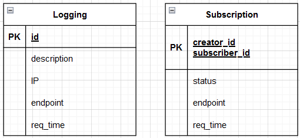

# travelution-soap

## Deskripsi
travelution-soap

## Overview Feature

## Skema basis data
Basis data terdiri atas 2 tabel, yaitu tabel logging dan subscription

## Daftar endpoint

## Cara menjalankan aplikasi
1. Pastikan sudah terinstall NodeJS, MySQL, dan Docker
2. Clone repositori ini
3. Buat file `.env` pada root folder aplikasi mengikuti contoh .env.example
4. Lakukan `docker compose up --build` dan `docker compose up`

## Pembagian Tugas

